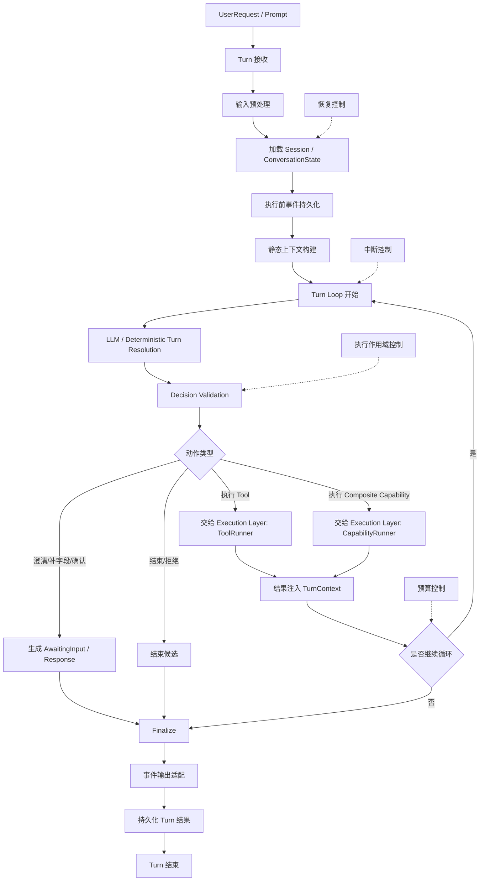

# Agent Runtime Refactor Plan

## Purpose

This document records the proposed refactor direction for the crop-calendar agent.

The goal is not to copy Claude Code implementation details directly. The goal is to extract reusable best practices for building business AI agent applications:

- context-driven turn understanding
- explicit business state
- safe tool and stateful composite capability execution
- auditable side effects
- repeatable evaluation
- framework-independent runtime abstractions

The target direction is:

```text
Claude-style context-driven turn decision
+ business-style explicit state / policy / validation
+ self-owned lightweight agent runtime
```

## Key Decisions

### Remove LangChain And LangGraph As Core Abstractions

LangChain and LangGraph should not be core runtime dependencies in the final architecture.

Recommended position:

- Remove LangGraph as the default workflow engine.
- Remove LangChain `BaseTool` / `@tool` as the tool abstraction.
- Remove direct business-layer dependency on `ChatOpenAI`, `HumanMessage`, `SystemMessage`, and `with_structured_output`.
- Keep a short migration adapter if needed while introducing the new runtime interfaces.

Reasoning:

- The current LangGraph usage is limited to one mostly deterministic business flow.
- The current LangChain tool usage is a thin wrapper and does not represent the business tool contract needed by the product.
- The planned runtime needs first-class state, policy, evaluation, and capability metadata.
- Claude Code demonstrates that checkpointing, interrupt/resume, multi-agent behavior, permissions, and persistence can be implemented as product runtime capabilities rather than graph-framework primitives.

### Keep Explicit Business State

Do not rely only on conversation history for business state.

LLM history can help judge whether a turn continues a previous task, but explicit state is still needed for:

- missing-field follow-ups
- option selection
- confirmation / cancellation
- destructive or write operations
- composite capability interruption and resume
- audit and replay
- external API transaction continuity

The old `pending resume` behavior should be downgraded from a heavy routing mechanism to explicit state used by the LLM turn resolver and deterministic validators.

### Make LLM The Semantic Resolver, Not The Safety Authority

The LLM should decide what the current turn likely means.

The system should decide whether that interpretation is valid and safe to execute.

```text
LLM judges intent and field updates.
System validates state, schema, policy, and side effects.
```

## Target Architecture

```text
Interface Layer
  Chainlit / FastAPI / future clients

Orchestration Layer
  TurnEngine
  ConversationContextBuilder
  LLMTurnResolver
  TurnDecisionValidator
  AgentEvent stream

Planning / Routing Layer
  ExplicitCommandRouter
  LLMPlanner / ToolSelector
  ActionPlanNormalizer

Execution Layer
  ExecutionEngine
  ToolRunner
  CapabilityRunner
  PolicyGate
  InputValidator
  ResultNormalizer
  ToolOrchestration

Capability Layer
  AgentTool registry
  Stateful composite capability registry
  Capability packs / skills

State Layer
  ConversationState
  ActiveTask
  AwaitingInput
  ConfirmationRequest
  OptionSelection
  Interaction / Event log
  Checkpoint-lite store

LLM Layer
  LLMClient Protocol
  OpenAI-compatible adapter
  Structured output parser
  Prompt / response tracing

Domain / Application Layer
  Agronomy services

Infrastructure Layer
  DB / HTTP / cache / config / stores

Evaluation & Observability Layer
  unit tests / scenario tests / eval_platform / production audit / traces
```

## Layer Responsibilities

### Interface Layer

Owns external entrypoints and UI/client concerns.

Current examples:

- `chainlit_app.py`
- `src/api/server.py`

Responsibilities:

- accept user input
- provide `session_id` and `user_id`
- render responses or event streams
- adapt client-specific payloads
- avoid business routing and composite capability logic

### Orchestration Layer

Owns the turn lifecycle.

Recommended modules:

```text
src/agent/orchestration/
  turn_engine.py
  context_builder.py
  turn_resolver.py
  turn_decision.py
  events.py
```

Responsibilities:

- load conversation state
- build LLM-visible context
- call the LLM turn resolver
- validate turn decisions
- produce action plans
- coordinate execution
- record state transitions and events

### Core Runtime Objects

The orchestration layer should be defined around four core runtime objects:

```text
Session
Turn
Message
State
```

Meaning:

- `Session`: the cross-turn conversation container
- `Turn`: one execution lifecycle triggered by one new input
- `Message`: the base unit for internal exchange, transcript, and context
- `State`: the current execution state for the turn and conversation

Useful shortcut:

```text
Session is the container.
Turn is one execution round.
Message is the information unit.
State is the runtime progression.
```

These objects should be explicit in the architecture before discussing planner, execution, or capability design.

### Turn Reception

Treat turn reception as its own stage.

It should not be merged with input preprocessing.

Purpose:

- accept a new external input
- attach it to the current session scope
- initialize the turn-scoped execution environment
- hand the turn into preprocessing and later stages

Recommended interpretation:

```text
Turn Reception = the point where one new input is formally accepted by the session engine.
```

This stage should stay narrow. It should not absorb:

- input normalization details
- persistence details
- context build details
- runtime loop logic

### Input Preprocessing

Input preprocessing should produce a turn-ready input bundle, not just a normalized prompt string.

Purpose:

```text
convert raw user input into a unified internal package
that orchestration, planner, execution, and persistence can all consume
```

The preprocessing result should support:

- route-friendly text
- preserved structured context
- internal messages
- light execution control flags
- metadata for replay and debugging

Suggested shape:

```python
class TurnInputBundle(BaseModel):
    messages: list[dict]
    route_text: str
    preserved_blocks: list[dict] = []
    should_execute: bool = True
    direct_result: str | None = None
    capability_hints: list[str] = []
    metadata: dict = {}
```

Important architectural rule:

```text
Do not force all input into one flat string.
Separate route text from preserved context.
```

That separation will make future support for:

- attachments
- images
- structured selections
- form-style follow-ups
- client-side UI state

much easier.

### Pre-Execution Persistence

Before entering the turn loop, persist a minimal event record.

Purpose:

- crash recovery
- replay
- observability
- audit
- production bad-case analysis

At minimum, record:

```text
turn_received
input_bundle_created
session_snapshot_ref
```

This does not need to be a heavy snapshot. It just needs to create a durable entry point for the turn.

### Static Context Build

Static context build should be a separate stage before the finite-step loop starts.

Purpose:

- gather stable conversation facts
- assemble the first decision context
- avoid rebuilding everything ad hoc inside the loop

Typical inputs:

- recent turn summaries
- active task
- awaiting input / confirmation
- latest result summary
- capability summary
- policy summary
- session metadata

This stage should produce the initial `TurnContext`.

### Orchestration Structure

The orchestration layer should be modeled as a session-aware, turn-scoped, finite-step loop.

Key idea:

```text
Session
  -> Turn
    -> Context build
    -> Decide
    -> Validate
    -> Dispatch
    -> Observe result
    -> Continue or finalize
```

Recommended structure:



Interpretation:

- `Session` is the cross-turn container.
- `Turn` is the lifecycle for one user input.
- `Turn Reception` accepts the input into the session engine.
- `Input Preprocessing` produces a turn-ready bundle.
- `Static Context Build` produces the initial turn context.
- `Turn Loop` is finite-step, not unbounded.
- orchestration decides and validates
- execution runs tools or stateful composite capabilities
- canonical state is updated after each turn

Recommended stop conditions for the finite-step loop:

- final answer is ready
- awaiting input / confirmation is created
- action becomes `none`
- execution fails and cannot recover
- max steps reached
- token / latency / budget limit reached

### Planning / Routing Layer

Owns action selection, but should stay thin.

Recommended modules:

```text
src/agent/planning/
  explicit_router.py
  llm_planner.py
  action_plan.py
  normalizer.py
```

Responsibilities:

- handle high-precision explicit commands
- route natural language through LLM planner / tool selector
- normalize `ActionPlan`
- reject invalid target names
- avoid large heuristic intent classification

Keep deterministic routing only for:

- explicit tool or high-level capability names
- slash-style commands if introduced
- empty input
- confirmation / cancellation
- numbered option selection
- clear structured commands such as `plan_id=123` deletion
- security and policy boundaries

Do not use heuristics for broad semantic intent classification.

### Execution Layer

Owns safe execution of a validated plan.

Recommended modules:

```text
src/agent/execution/
  engine.py
  tool_runner.py
  capability_runner.py
  policy.py
  validation.py
  result.py
```

Responsibilities:

- validate tool/capability input schema
- check policy before side effects
- run tools and stateful composite capabilities
- handle cache
- normalize errors
- update follow-up / awaiting state
- emit execution events
- support read-only concurrency and write-operation serialization

### Capability Layer

Owns what the agent can do.

Recommended modules:

```text
src/agent/capabilities/
  tool.py
  registry.py
  composite.py
  packs/
```

Each atomic tool should declare:

```text
name
description
when_to_use
when_not_to_use
input_schema
required_fields
examples
negative_examples
side_effect: none | read | write | destructive
requires_confirmation
cacheable
concurrency_safe
followup_policy
session_context_fields
```

For multi-step business flows, introduce a stateful composite capability instead of a separate workflow runtime by default.

This replaces the current LangChain tool wrapper as the source of truth.

### State Layer

Owns explicit business state and replayable runtime state.

Recommended modules:

```text
src/agent/state/
  models.py
  store.py
  checkpoints.py
```

Important state models:

```text
ConversationState
ActiveTask
AwaitingInput
ConfirmationRequest
OptionSelection
CapabilityCheckpoint
InteractionEvent
```

Example:

```python
class AwaitingInput(BaseModel):
    task_id: str
    capability: str
    kind: Literal["missing_fields", "option_select", "confirmation"]
    draft: dict
    missing_fields: list[str] = []
    options: list[dict] = []
    expires_at: datetime
```

### LLM Layer

Owns model access and structured output parsing.

Recommended modules:

```text
src/infra/llm_client.py
src/infra/openai_client.py
```

Business code should depend on a protocol:

```python
class LLMClient(Protocol):
    def complete(
        self,
        messages: list[LLMMessage],
        options: LLMOptions,
    ) -> LLMResponse:
        ...

    def structured(
        self,
        messages: list[LLMMessage],
        schema: type[BaseModel],
        options: LLMOptions,
    ) -> StructuredLLMResponse:
        ...
```

The initial implementation can wrap LangChain during migration, but business code should stop importing LangChain types directly.

### Domain / Application Layer

Owns agronomy business logic.

Current examples:

- `src/domain/`
- `src/application/services/`

Responsibilities:

- weather business rules
- variety matching
- sowing suitability
- crop calendar payload construction
- growth-stage query
- farm task payload construction

Agent runtime should call application services instead of embedding business payload logic in routers or UI adapters.

### Evaluation & Observability Layer

Owns confidence in runtime evolution.

Current examples:

- `tests/`
- `tests/scenarios/`
- `src/eval_platform/`
- `src/eval_assets/`
- `src/observability/`

The refactor should expand evaluation coverage for:

- `TurnDecision`
- tool selection
- composite capability state transitions
- policy gates
- input validation
- multi-turn state recovery
- conversation replay
- production audit promotion

## New Turn Lifecycle

Target flow:

```text
UserRequest
  -> load ConversationState
  -> ConversationContextBuilder
  -> ExplicitCommandRouter
  -> LLMTurnResolver
  -> TurnDecisionValidator
  -> ActionPlanNormalizer
  -> ExecutionEngine
  -> StateRecorder
  -> ResponseBuilder
```

Expanded:

```text
1. Load state
   - recent interactions
   - active task
   - awaiting input
   - latest tool/capability result
   - unresolved confirmation or option selection

2. Build context
   - current user prompt
   - compact recent turn history
   - explicit business state
   - available tools/capabilities
   - policy constraints

3. Resolve turn
   - continue existing task
   - start new task
   - confirm
   - cancel
   - select option
   - clarify
   - answer none

4. Validate decision
   - target capability exists
   - schema is valid
   - awaiting state is compatible
   - write/destructive operation is confirmed
   - low-confidence result asks for clarification

5. Execute
   - run tool or composite capability
   - apply policy
   - normalize result
   - emit events

6. Persist
   - update conversation state
   - update checkpoint if needed
   - record interaction lineage
   - log eval-ready trace
```

## TurnDecision Contract

The LLM turn resolver should return structured output.

Example shape:

```python
class TurnDecision(BaseModel):
    action: Literal[
        "execute",
        "continue_existing",
        "start_new",
        "clarify",
        "confirm",
        "cancel",
        "select_option",
        "answer_none",
    ]
    target_kind: Literal["tool", "capability", "none"] = "none"
    target_name: str | None = None
    structured_input: dict = {}
    field_updates: dict = {}
    confidence: float = 0.0
    rationale: str | None = None
```

This replaces most heuristic contextual routing.

## ActionPlan Contract

`ActionPlan` remains useful as the normalized execution input.

```python
class ActionPlan(BaseModel):
    action: Literal["tool", "capability", "none"]
    name: str | None = None
    input: dict | str | None = None
    response: str | None = None
    reason: str | None = None
```

The LLM may produce `TurnDecision`; the system converts it to a validated `ActionPlan`.

## Tool Contract

Replace LangChain `BaseTool` with a product-specific tool contract.

```python
class AgentTool(Protocol):
    name: str
    description: str
    input_model: type[BaseModel]
    side_effect: SideEffect
    cacheable: bool
    concurrency_safe: bool
    requires_confirmation: bool

    def execute(
        self,
        input: BaseModel,
        ctx: ExecutionContext,
    ) -> ToolResult:
        ...
```

Suggested side-effect enum:

```python
class SideEffect(str, Enum):
    NONE = "none"
    READ = "read"
    WRITE = "write"
    DESTRUCTIVE = "destructive"
```

Policy examples:

```text
weather_lookup -> allow
variety_lookup -> allow
sowing_suitability_lookup -> allow
plant_plan_list_active -> allow
plant_plan_delete -> ask
plant_task_create -> ask or allow_with_explicit_input
crop_calendar_save -> ask
memory_clear -> ask
```

## Stateful Composite Capability Contract

Replace the current standalone LangGraph workflow with a stateful composite capability driven by the main turn loop.

```python
class CompositeCapability(Protocol):
    name: str
    input_model: type[BaseModel] | None

    def advance(
        self,
        state: dict,
        ctx: ExecutionContext,
    ) -> CapabilityStepResult:
        ...
```

`CapabilityStepResult` should support:

```text
completed
awaiting_input
requires_confirmation
failed
continue
```

The current `crop_calendar_workflow` should be reimplemented as one stateful composite capability.

Its external product-facing name may stay the same, but internally it should no longer rely on a separate workflow runtime.

It should be decomposed into explicit step handlers:

```text
CropCalendarPlanCapability
  PlantingExtractionStep
  MissingFieldStep
  VarietyResolutionStep
  CalendarPreviewStep
  SaveConfirmationStep
  PlanActivationStep
```

Important boundary:

- orchestration owns the canonical conversation state
- the composite capability owns only its namespaced substate and step logic
- awaiting input / confirmation stay in orchestration state
- each step delegates business logic to application services

## Checkpoint-Lite Model

Removing LangGraph does not mean losing interruption and resume.

Start with a lightweight checkpoint model:

```python
class CapabilityCheckpoint(BaseModel):
    capability_name: str
    task_id: str
    status: Literal["running", "awaiting_input", "completed", "failed"]
    state: dict
    awaiting_input: AwaitingInput | None = None
    updated_at: datetime
```

This is enough for:

- missing-field continuation
- option selection
- confirmation
- capability resume
- eval replay
- audit

If a future business flow truly needs graph semantics, add it behind the same composite capability contract rather than making graph runtime the default architecture.

## What To Keep From Claude Code

Do not copy code directly. Reuse these design patterns:

- query / turn lifecycle as the central runtime concept
- rich tool contract
- execution separated from tool selection
- permission and policy gate before side effects
- event stream and transcript as runtime artifacts
- explicit task state for long-running operations
- plan mode as a capability, not a global architecture dependency
- context compaction and state snapshots for long sessions

Important distinction:

```text
Claude Code has planning capability.
It does not use a traditional backend Planning Layer that returns a fixed ActionPlan.
```

For this project, keep both:

- thin planning/routing layer for business capability selection
- plan-mode-like capability for complex, high-risk composite capabilities

## What To Remove Or Reduce

Reduce:

- keyword-heavy intent routing
- large contextual resume heuristics
- tool-specific session restoration chains
- business logic in `chainlit_app.py`
- business logic inside orchestration code

Eventually remove:

- `langgraph`
- `langchain_core.tools`
- `langchain_core.messages`
- direct `langchain_openai.ChatOpenAI` dependency in business modules

Keep temporarily:

- LangChain-backed LLM adapter, if needed during migration

## Migration Plan

### Phase 0: Freeze Behavior

Before heavy refactor:

- add scenario tests for current critical behavior
- cover missing-field follow-up
- cover option selection
- cover confirmation/cancellation
- cover delete plan
- cover save plan
- cover plant task creation
- cover context switching
- cover out-of-scope prompts

### Phase 1: Introduce LLMClient Protocol

Add a self-owned LLM interface.

Initial implementation can wrap existing LangChain usage.

Goal:

- no new business code imports `ChatOpenAI`
- no new business code imports `HumanMessage` / `SystemMessage`
- structured output goes through project-owned parser

### Phase 2: Introduce AgentTool Protocol

Add self-owned tool definitions and registry.

Keep old tools callable through adapters if needed.

Goal:

- tool metadata becomes structured and complete
- planner gets tool descriptions from self-owned registry
- execution gets schema/policy/cache information from same registry

### Phase 3: Migrate Tools

Move tools from LangChain `@tool` into `AgentTool.execute()`.

Prioritize:

1. `plant_plan_delete`
2. `plant_task_create`
3. `memory_clear`
4. read-only lookup tools

Reasoning:

- write/destructive tools benefit most from explicit policy.

### Phase 4: Introduce CompositeCapability Protocol

Add a stateful composite capability abstraction independent of LangGraph.

Goal:

- capability execution returns explicit status
- interruption and awaiting input are first-class
- capability substate can be persisted inside canonical conversation state

### Phase 5: Migrate Crop Calendar Workflow To Stateful Composite Capability

Replace `StateGraph` execution with step handlers driven by the main turn loop.

Decompose workflow logic into:

- extraction step
- missing field step
- variety resolution step
- preview/recommendation step
- save confirmation step
- activation step

Goal:

- LangGraph no longer needed for the current crop-calendar business flow.

### Phase 6: Introduce ConversationContextBuilder

Build model-visible context from:

- recent turn history
- active task
- awaiting input
- latest tool result
- capability substate / checkpoint
- available capabilities
- policy constraints

Goal:

- LLM can judge whether the current turn continues previous context.
- explicit state remains available for deterministic validation.

### Phase 7: Introduce LLMTurnResolver

Use structured `TurnDecision` for semantic turn resolution.

Goal:

- replace most contextual heuristics
- make LLM-first turn interpretation the default
- keep deterministic rules only for high-precision commands and safety boundaries

### Phase 8: Split Execution Engine

Break current executor responsibilities into:

- input validation
- policy gate
- tool runner
- capability runner
- result normalizer
- state updater

Goal:

- execution no longer depends on planner/router internals.

### Phase 9: Thin The Router

Move from:

```text
pending -> session_context heuristic -> standalone intent -> resolution
```

to:

```text
conversation context -> LLM turn decision -> validation/policy -> execution
```

Keep explicit command router small and deterministic.

### Phase 10: Remove Dependencies

After business modules no longer import LangChain/LangGraph:

- remove `langchain`
- remove `langgraph`
- remove `langchain-openai`
- update tests
- update README and deployment docs

## Evaluation Strategy

The refactor should be driven by tests and evals.

Recommended coverage:

```text
TurnDecision evals
  user turn -> expected decision

ToolSelection evals
  prompt/context -> expected tool/capability

StateTransition tests
  awaiting_input -> user response -> next state

Policy tests
  write/destructive action -> ask/deny/allow

Composite capability step tests
  step input -> step output

Replay tests
  conversation event log -> same final state/result

Production audit
  sampled real conversations -> judge/human review -> promoted cases
```

Important rule:

```text
Do not add broad heuristic routing for new bad cases.
Prefer tool metadata, planner prompt updates, schema validation, policy, or eval cases.
```

## Final Design Principles

```text
TurnEngine manages the turn.
LLMClient manages model access.
AgentTool declares capability and constraints.
CompositeCapability advances business multi-step capability state.
PolicyGate controls side effects.
StateStore owns recovery and replay.
Eval proves quality across changes.
```

Operational boundaries:

```text
Orchestration does not guess business details.
Planning does not execute actions.
Execution does not interpret natural language.
Atomic tools and composite capabilities declare capabilities and constraints.
State records business facts.
Policy controls side effects.
Evaluation constrains runtime evolution.
```

## Open Questions

- Should `TurnDecision` and `ActionPlan` be separate long term, or should they merge after migration?
- How much recent transcript should `ConversationContextBuilder` include before compaction?
- Should capability substate live inside the main conversation state object or in a separate checkpoint store?
- Should capability packs be introduced now, or after tools/composite capabilities are migrated?
- Should plan-mode-like behavior be implemented for crop calendar save flows, or only for future complex composite capabilities?
- Which LLM structured output strategy should replace `with_structured_output` first: OpenAI SDK response format, JSON schema prompting, or project-level retry/repair?
