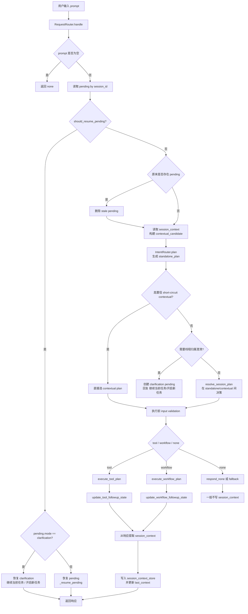
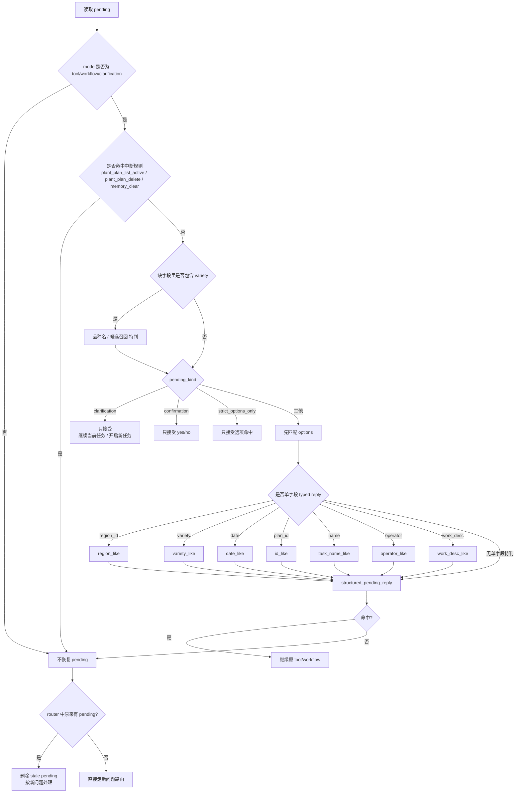

# 会话管理流程图

下面是当前工程里“会话管理”的 3 张拆分图，按真实代码执行顺序整理。

## 1. 总流程



## 2. Pending 恢复流程



## 3. Session Context 续接流程

```mermaid
flowchart TD
    A[上轮执行成功后的响应] --> B{是否仍有 missing_fields?}
    B -- 是 --> C[不写 session_context]
    B -- 否 --> D[extract_session_context_from_tool/workflow]

    D --> E{能提取上下文?}
    E -- 否 --> F[不写]
    E -- 是 --> G[写入 tool_contexts/workflow_contexts]
    G --> H[更新 last_context = 最近一次成功上下文]

    H --> I[下一轮用户输入]
    I --> J[build_contextual_candidate]
    J --> K{只看 last_context 对应 adapter}
    K --> L[build_candidate(prompt, context)]

    L --> M{生成 contextual_candidate?}
    M -- 否 --> N[只用 standalone_plan]
    M -- 是 --> O[同时仍会跑 standalone_plan]
    O --> P{candidate.confidence >= 0.85<br/>且 standalone 为 none 或同 action/name}
    P -- 是 --> Q[直接 short-circuit 选 contextual]
    P -- 否 --> R{短句且 standalone/contextual 冲突?}
    R -- 是 --> S[创建 clarification pending]
    R -- 否 --> T[resolve_session_plan]
    T --> U[standalone / contextual 二选一]
```

## 4. 关键代码入口

- 总入口：[router.py](/f:/workspace/nlp-crop-calendar/src/agent/router.py)
- Pending 判断：[pending_manager.py](/f:/workspace/nlp-crop-calendar/src/agent/pending_manager.py)
- Session context 适配与续接：[session_context.py](/f:/workspace/nlp-crop-calendar/src/agent/session_context.py)
- Standalone 路由：[intent_router.py](/f:/workspace/nlp-crop-calendar/src/agent/intent_router.py)
- 执行与 follow-up 状态写回：[plan_executor.py](/f:/workspace/nlp-crop-calendar/src/agent/plan_executor.py)
